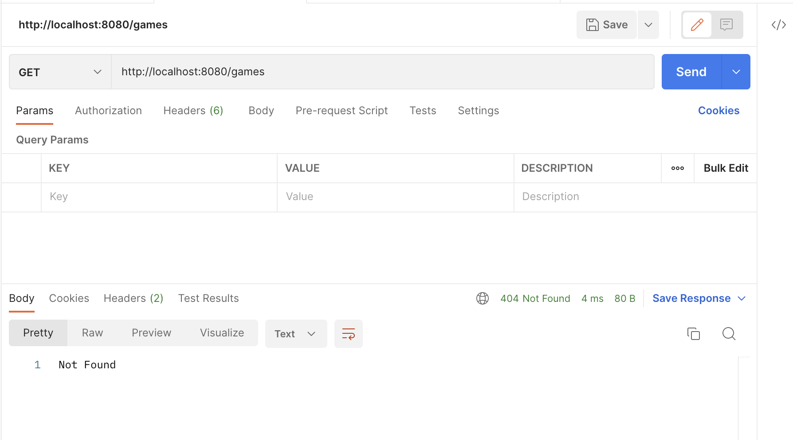

# Rest Api : Baseball Project

This project is a program that retrieve information from a CSV file in order to be able to see some specific information. It takes a specific file name `mbl_elo.csv` or `mlb_elo_latest.csv` as an input, it stores all the information into a postgreSQL database and then we can retrieve specific information thanks to the several endpoints. The program is implemented in Scala using the ZIO library.
## Table of contents :

1. [ Getting Started ](#getting-started)
2. [ Usage](#usage)
3. [ Implementation Details](#implementation)\
	a. [ Tree of the project](#structure)\
	b. [ Data Structure in postgreSQL](#data-structure-postgresql)\
	&nbsp; &nbsp; &nbsp; 1) [ Database](#database)\
	&nbsp; &nbsp; &nbsp; 2) [ Functions](#functions)\
    c.[ Data Structure in scala](#data-structure-scala)\
	&nbsp; &nbsp; &nbsp; 1) [ Object Pattern](#object-pattern)\
	&nbsp; &nbsp; &nbsp; 2) [ Objects](#objects)\
	&nbsp; &nbsp; &nbsp; 3) [ Traits](#traits)\
	&nbsp; &nbsp; &nbsp; 4) [ Case class Game](#case-class-game)\
	&nbsp; &nbsp; &nbsp; 5) [ Object Game](#object-game)\
   	d.[ Api Structure](#api-structure)\
    e.[ Tests](#tests)
5. [ Depedencies](#depedencies)
6. [ Organization](#organization)
7. [ Authors](#authors)


## <a id="getting-started"></a> Getting Started

1. Clone the repository: 
```
git clone https://github.com/NovaGamma/scalaMLB.git
```
2. Navigate to the project directory 
```
cd scalaMLN
```
3. Build the project
```
sbt compile
```

## <a id="usage"></a>  Usage

1. Run the program
```
sbt run
```
2. Choose the endpoint you want

## <a id="implementation"></a>  Implementation Details

###  <a id="structure"></a> Tree of the project
The progam is structured as follows :
```
src                         
├─ main                     
│  └─ scala                 
│     ├─ DataService.scala  
│     ├─ Game.scala         
│     └─ MlbApi.scala       
└─ test                     
   └─ scala                 
      └─ MlbApiSpec.scala       
```

- `DataService.scala`: This file will interact with the database : creation of the ZIO Pool, connection to the pool with postgre properties, creation of the database, some queries...
- `Game.scala`: Defines the `Game` case class, which represents one Game. 
- `MlbApi.scala`: Contains all the different endpoints we thought it was useful. It is the entry point of the program. It handles the execution, including reading and parsing the CSV file, instert into the database and start the server
- `test/MlbApiSpec.scala`: Contains the tests to check if our api implementation is correct. 

You can run them using: 
```
sbt test
```

The program follows these steps :
1. Creation of the table in the database
1. Open & Read CSV file : The program will open the file we specify in the `CSVReader`
2. Converting CSV to our structure & Insertion in the DB : The program verifies the CSV file and convert each row into our game structure. Then, it inserters each rows into the table.
3. Play with it: It is time to play with it retrieving information you want from the api


### <a id="data-structure-postgresql"></a> Data Strucure in PostgreSQL

As we said, the `DataService.scala` file provides functionality for interacting with a database and retrieving Major League Baseball (MLB) game data. It contains the implementation of a data service for an MLB application. It uses the ZIO, ZIO JDBC, and ZIO HTTP libraries to connect to a database (See the [Dependencies](#depedencies) section for more information), create tables, insert data, and retrieve game information.


#### <a id="database"></a>  Database
We choose to be simple and create only one table called `Games`. This table will contain every columns we need :
- The date : Represents the date of the game
- The season year : Represents the season year of the game
- The playoff round : Represents the playoff round of the game
- The Home Team : Represents the home team of the game
- The Away Team : Represents the away team of the game
- The Home Player : Represents the home player of the game
- The Away Player : Represents the away player of the game
- The Home Score : Represents the home score of the game
- The Away Score : Represents the away score of the game
- The Home Elo prediction : Represents the home elo prediction of the game
- The Away Elo prediction : Represents the away elo prediction of the game
- The Home MLB rating : Represents the home mlb rating of the game
- The Away MLB rating : Represents the away mlb rating of the game

Each colmuns of this table are reunited into a final case class Game, which is composed of several objects (everything is explained into the section about the `Game.scala` file).

#### <a id="functions"></a>  Functions
There is several  that used sql queries for interacting with the MLB game data stored in the database. Here's an overview of the most important : 

```scala
def insertRows(games: List[Game]): ZIO[ZConnectionPool, Throwable, UpdateResult]
```
Inserts a list of Game objects into the "Games" table.It converts each Game object into a Game.Row object, which represents a single row of data in the table.

```scala
def latest(homeTeam: HomeTeam, awayTeam: AwayTeam): ZIO[ZConnectionPool, Throwable, Option[Game]]
```
Retrieves the most recent game between the specified home team and away team.

```scala
def historyTeam(team: String): ZIO[ZConnectionPool, Throwable, zio.Chunk[Game]]
```
Retrieves the game history for a given team, regardless of whether they played at home or away.

```scala
def historyPitcher(pitcher: String): ZIO[ZConnectionPool, Throwable, zio.Chunk[Game]]
```
Retrieves the game history for a given pitcher, regardless of whether they played at home or away.

```scala
def realLatest(team: String): ZIO[ZConnectionPool, Throwable, Option[Game]]
```
Retrieves the most recent game involving a specific team, regardless of their role (home or away).

```scala
def victoriesAndDefeats(team: String, season: SeasonYear): ZIO[ZConnectionPool, Throwable, Option[zio.jdbc.ZResultSet]]
```
Retrieves the number of victories and defeats for a specific team in a specific season.

### <a id="data-structure-scala"></a> Data Structure in Scala

The `Game.scala` file defines the Game case class and provides type definitions and encoders/decoders for its fields. This case class represents an MLB game, including various attributes such as the date, season, teams, players, scores, Elo ratings, and MLB ratings which is used in the previous file (`DataService.scala`). It is composed of several entities :

#### <a id="object-pattern"></a>  Object Pattern
Each object has the same pattern :
- An opaque type T
- Some functions :
```scala
def apply : Create values of the corresponding type
def unapply : Extract values of the corresponding type
def safe : Create type with a non-negative value
```
- CanEqual instance for equality comparisons
- Encoder and Decoder instances for JSON serialization/deserialization


#### <a id="objects"></a>  Objects
- GameDates: The GameDates object defines the GameDate opaque type, representing the date of an MLB game using the LocalDate type. 
- SeasonYears : The SeasonYears object defines the SeasonYear opaque type, representing the season year of an MLB game as an integer value.
- PlayoffRound : The PlayoffRounds object defines the PlayoffRound opaque type, representing the playoff round of an MLB game as an integer value.

#### <a id="traits"></a>  Traits


Teams is a trait defining a type alias T for representing MLB teams where HomeTeams & AwaysTeams are extending from it and defining the opaque types HomeTeam and AwayTeam respectively.


Players is a trait defining a type alias T for representing MLB players where HomePlayers & AwaysPlayers are extending from it and defining the opaque types HomePlayer and AwayPlayer respectively.


Scores is a trait defining a type alias T for representing scores  where HomeScores & AwaysScores are extending from it and defining the opaque types HomeScore and AwayScore respectively.


Elos is a trait defining a type alias T for representing Elos prediction where HomeElos & AwaysElos are extending from it and defining the opaque types HomeElo & AwaysElo respectively.


Mlbs is a trait defining a type alias T for representing MLBs ratings where HomeMlbs & AwaysMlbs are extending from it and defining the opaque types HomeMlb & AwaysMlb respectively.

#### <a id="case-class-game"></a>  Case class Game

The Game case class represents an MLB game. It follows the same pattern as the table Games detailed in [Data Strucure in PostgreSQL](#data-structure-postgresql) using the types we explained above.


#### <a id="object-game"></a>  Object Game

The Game object serves as a final object that incorporates everything defined in the `Game.scala file`. It includes the same pattern as a simple object with some differences :  

- Row type alias representing a tuple that matches the structure of a database row for Game.
- toRow extension method for converting a Game object into a row tuple.
- jdbcDecoder for custom JDBC decoding of rows into Game objects.

### <a id="api-structure"></a> Api Structure

We will explain each endpoints :

| Endpoint | Description |
| --- | --- |
| /text| Static route which output is a text: <pre>"Hello MLB Fans!"</pre>|
| /json | Static route which output is a json:  <pre>{"greetings": "Hello MLB Fans!"}</pre>|
| /init | Not implemented |
| /game/latest/{homeTeam}/{awayTeam}| Retrieve the latest game between the specified home team and away team |
| /game/predict/{homeTeam}/{awayTeam} | Predict the outcome of the game between the specified home team and away team |
| /games/count| Count the number of games in the data |
| /games/history/{homeTeam} | Retrieve the game history for the specified team |
| /pitcher/history/{pitcher} | Retrieve the game history for the specified pitcher |
| /team/victory_defeat/{team}/{year} | Retrieve all the victory and defeat of a specific team in a specific season year | 
| Not Found| Endpoint not found |

### <a id="test"></a> Tests

It was difficult to test our endpoints using scala (not the static ones but the others) because the type was a ZConnectionPool so we didn't figured how to do this (we can see what we try to do in the file `MlbApiSpec.scala`.

But we test them in Postman, here is the output for each one :

#### Static Route
- `/text`: 
- `/json`: 

#### Database Endpoints
- `/init`: 
- `/game/latest/{homeTeam}/{awayTeam}`: 
- `/game/predict/{homeTeam}/{awayTeam}` : 
- `/games/count` : 
- `/games/history/{homeTeam}` : 
- `/pitcher/history/{pitcher}` : 
- `/team/victory_defeat/{team}/{year}`: 
- `Not found` : 


## <a id="depedencies"></a> Dependencies
We use the entire ZIO library as it was suggested. In this library, we use :

- `zio-json` which is a powerful library for working with JSON in Scala, providing capabilities for both decoding and encoding JSON data (It was useful for the serialization and deserializaiton part).
- `zio-jdbc` which provides support for interacting with relational databases using the ZIO concurrency model.
- `zio-http`  which provides support for building and consuming HTTP services using the ZIO concurrency model. 
- `zio-stream` which provides support for working with streams of data in a functional and composable way. 

We need also some import that are not in Scala, so we need to import java libraries :
- `java.time.LocalDate` which represents a date without a time component, and it is used in the code to represent the game dates.
-  `java.sql.Date` used in the code for JDBC-related operations, as JDBC often uses java.sql.Date for representing dates in database interactions.

In order to handle csv, we need to import from github :

- `com.github.tototoshi.csv._` which enables reading and writing CSV files using Scala. 

Finally, we used imports from Scala utils to deal with errors in native way :

- `scala.util.Try` which represents the result of a computation that may either succeed or fail. It is used in the code for error handling and encapsulating potentially throwing operations.


## <a id="organization"></a>  Organization 
This project was different from the Sudoku one, it required more organizations. What we did is : 
- CSV to Database, connection, creation  of the tables, data structure ... : BLANC & JAMINON using LiveShare extension
- API : AUPIAS--BERTHY
- Test : BLANC
- Handling errors : JAMINON & AUPIAS--BERTHY
- Documentation : everyone

## <a id="authors"></a>  Authors
- Elvin AUPIAIS--BERTHY
- Monica-Pauline BLANC
- Hugo JAMINON

### Project compiled with Scala 3.3.0

